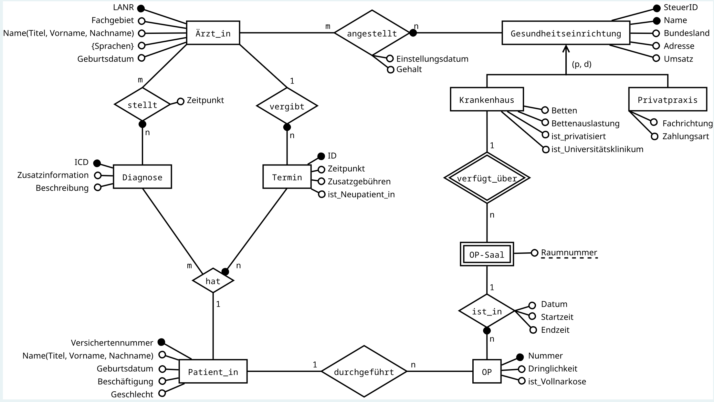

### **Realisierung**

**Hier erstellen wir einfach eine Tabelle und diese Tabelle hat nur einen Primärschlüssel**

CREATE TABLE Ärzt_in 🏷
(
LANR         CHAR(9) NOT NULL,
Fachgebiet   VARCHAR(255) NOT NULL,
Name         STRUCT(Titel VARCHAR(255), Vorname VARCHAR(255), Nachname VARCHAR(255)) NOT NULL,
Sprachen     BPCHAR[] NOT NULL,
Geburtsdatum DATE NOT NULL,
PRIMARY KEY (LANR),
CHECK (length(LANR) = 9 AND LANR LIKE '_________'),
CHECK (Geburtsdatum > '1956-05-17')
);

**Auch hier haben wir nur einen Primärschlüssel**

CREATE TABLE Diagnose 🏷
(
ICD CHAR(3) NOT NULL,
Zusatzinformation CHAR(1) NOT NULL,
Beschreibung STRING,
PRIMARY KEY (ICD),
CHECK (regexp_matches(ICD, '^[A-Z][0-9]{2}$')),
CHECK (Zusatzinformation = 'G' OR
Zusatzinformation = 'V' OR
Zusatzinformation = 'A' OR
Zusatzinformation = 'L' OR
Zusatzinformation = 'R' OR
Zusatzinformation = 'B')
);

**Hier erstellen wir eine Sequenz für unseren Schlüssel.
In Postgres können wir beispielsweise beim Erstellen eines
Schlüssels einfach "seriel" schreiben. Dies bedeutet,
dass wir uns beim Einfügen von Werten in die Tabelle
nicht um den Schlüssel kümmern müssen, sondern
dieser automatisch generiert wird**

CREATE SEQUENCE serial START WITH 1 INCREMENT BY 1 MAXVALUE 3000000;

**Da wir hier die Beziehung n zu 1 haben, müssen wir in dieser
Tabelle ein zusätzliches Attribut erstellen, das auf den
Primärschlüssel in einer anderen Tabelle verweist.
Und so werden diese beiden Tabellen verbunden**

CREATE TABLE Termin 🏷
(
ID UINTEGER DEFAULT nextval('serial') NOT NULL,
Zeitpunkt DATETIME NOT NULL,
Zusatzgebühren NUMERIC(5, 2) NOT NULL DEFAULT 0,
ist_Neupatient_in LOGICAL NOT NULL,
LANR CHAR(9) NOT NULL,
PRIMARY KEY (ID),
FOREIGN KEY (LANR) REFERENCES Ärzt_in(LANR),
UNIQUE(LANR, Zeitpunkt),
CHECK (Zusatzgebühren>=0 AND Zusatzgebühren<=500.00)
);

**Hier haben wir nur den Primärschlüssel und keinen Fremdschlüssel**

CREATE TABLE Patient_in 🏷
(
Versichertennummer CHAR(10) NOT NULL,
Name STRUCT(Titel VARCHAR(255), Vorname VARCHAR(255), Nachname VARCHAR(255)) NOT NULL,
Geburtsdatum DATE NOT NULL,
Beschäftigung VARCHAR(255),
Geschlecht CHAR(1),
PRIMARY KEY (Versichertennummer),
CHECK (regexp_matches(Versichertennummer, '^[A-Z][0-9]{8}[0-9]$')),
CHECK (Geschlecht = 'd' OR Geschlecht = 'w' OR Geschlecht = 'm')
);

**Da wir eine Viele-zu-Viele-Beziehung haben, müssen wir die
Primärschlüssel aus den beiden Tabellen entnehmen und gleichzeitig
angeben, dass es sich um Referenzschlüssel handelt**

CREATE TABLE stellt 🏷
(
LANR CHAR(9) NOT NULL,
ICD CHAR(3) NOT NULL,
Zeitpunkt DATETIME NOT NULL,
PRIMARY KEY(LANR, ICD),
FOREIGN KEY (LANR) REFERENCES Ärzt_in(LANR),
FOREIGN KEY (ICD) REFERENCES Diagnose(ICD),
UNIQUE (LANR, Zeitpunkt)
);

**Hier ist die Situation ähnlich wie oben**

CREATE TABLE hat ( 🏷
ICD CHAR(3) NOT NULL,
ID UINTEGER NOT NULL,
Versichertennummer CHAR(10) NOT NULL,
PRIMARY KEY (ICD, ID),
FOREIGN KEY (ICD) REFERENCES Diagnose(ICD),
FOREIGN KEY (ID) REFERENCES Termin(ID),
FOREIGN KEY (Versichertennummer) REFERENCES Patient_in(Versichertennummer)
);

**Hier haben wir einen bestimmten Stil umgesetzt. Die Idee besteht darin,
alle Attribute aus allen anderen Tabellen in einer Tabelle zusammenzufassen
und je nach Bedingung die Attribute auszuwählen, die wir benötigen**

CREATE TABLE Gesundheitseinrichtung 🏷
(
SteuerID CHAR(11) NOT NULL,
Name VARCHAR(255) NOT NULL,
Bundesland CHAR(5) NOT NULL,
Adresse VARCHAR(255) NOT NULL,
Umsatz NUMERIC(15,2) NOT NULL,
Typ VARCHAR(255) NOT NULL,
Betten USMALLINT,
Bettenauslastung FLOAT4,
ist_privatisiert LOGICAL,
ist_Universitätsklinikum LOGICAL,
Fachrichtung VARCHAR(255),
Zahlungsart VARCHAR(255),
PRIMARY KEY (SteuerID, Name),
CHECK (regexp_matches(SteuerID, '^DE[0-9]{9}$')),
CHECK (regexp_matches(Bundesland, '^DE-[A-Z]{2}$')),
CHECK (Umsatz <= 9999999999999.99),
CHECK (Betten <= 1500),
CHECK (Bettenauslastung >= 0 AND Bettenauslastung <= 1.0),
CHECK (Zahlungsart = 'Versichert' OR Zahlungsart = 'Selbstzahler'),
CHECK (
(Typ = 'Krankenhaus' AND Betten IS NOT NULL AND Bettenauslastung IS NOT NULL AND ist_privatisiert IS NOT NULL AND ist_Universitätsklinikum IS NOT NULL AND Fachrichtung IS NULL AND Zahlungsart IS NULL)
OR (Typ = 'Privatpraxis' AND Fachrichtung IS NOT NULL AND Zahlungsart IS NOT NULL AND Betten IS NULL AND Bettenauslastung IS NULL AND ist_privatisiert IS NULL AND ist_Universitätsklinikum IS NULL)
OR (Typ = 'Gesundheitseinrichtung' AND Betten IS NULL AND Bettenauslastung IS NULL AND ist_privatisiert IS NULL AND ist_Universitätsklinikum IS NULL AND Fachrichtung IS NULL AND Zahlungsart IS NULL)
)
);

**Beziehung m : n, wir machen alles genauso wie ich schon früher oben beschrieben habe**

CREATE TABLE angestellt ( 🏷
LANR CHAR(9) NOT NULL,
SteuerID CHAR(11) NOT NULL,
Name VARCHAR(255) NOT NULL,
Einstellungsdatum DATE NOT NULL,
Gehalt NUMERIC(7,2) NOT NULL,
PRIMARY KEY (LANR, SteuerID, Name),
FOREIGN KEY (LANR) REFERENCES Ärzt_in(LANR),
FOREIGN KEY (SteuerID, Name) REFERENCES Gesundheitseinrichtung(SteuerID, Name),
CHECK (
NOT (
(month(Einstellungsdatum) = 1 AND dayofmonth(Einstellungsdatum) = 1) OR
(month(Einstellungsdatum) = 3 AND dayofmonth(Einstellungsdatum) = 8) OR
(month(Einstellungsdatum) = 5 AND dayofmonth(Einstellungsdatum) = 1) OR
(month(Einstellungsdatum) = 10 AND dayofmonth(Einstellungsdatum) = 3) OR
(month(Einstellungsdatum) = 12 AND dayofmonth(Einstellungsdatum) = 25) OR
(month(Einstellungsdatum) = 12 AND dayofmonth(Einstellungsdatum) = 26)
)
),
CHECK (Gehalt >= 5288.32 AND Gehalt <= 11019.20)
);

**Hier haben wir eine schwache Entität, deren Schlüssel stark von anderen
Schlüsseln abhängt, also fügen wir auch diese hinzu und verweisen auf
andere Tabellen, um die Verbindung zu zeigen**

CREATE TABLE 'OP-Saal'( 🏷
Raumnummer UTINYINT NOT NULL,
SteuerID CHAR(11) NOT NULL,
Name VARCHAR(255) NOT NULL,
PRIMARY KEY (Raumnummer, SteuerID, Name),
FOREIGN KEY (SteuerID, Name) REFERENCES Gesundheitseinrichtung(SteuerID, Name),
CHECK (Raumnummer >= 0 AND Raumnummer <= 20)
);

**Hier stellt sich heraus, dass wir ein zusätzliches Attribut als
Fremdschlüssel hinzufügen müssen, dieser Schlüssel jedoch vor anderen
Schlüsseln abhängig ist, da es sich um eine schwache Entität handelt,
sodass die Struktur wie folgt aussieht**

CREATE TABLE OP( 🏷
Nummer UUID NOT NULL,
Dringlichkeit VARCHAR(255) NOT NULL,
ist_Vollnarkose LOGICAL NOT NULL,
Datum DATE NOT NULL,
Startzeit TIME NOT NULL,
Endzeit TIME NOT NULL,
Versichertennummer CHAR(10),
Raumnummer UTINYINT NOT NULL,
SteuerID CHAR(11) NOT NULL,
Name VARCHAR(255) NOT NULL,
PRIMARY KEY (Nummer),
FOREIGN KEY(Versichertennummer) REFERENCES Patient_in(Versichertennummer),
FOREIGN KEY(Raumnummer, SteuerID, Name) REFERENCES 'OP-Saal'(Raumnummer, SteuerID, Name),
CHECK (Dringlichkeit = 'Notoperation' OR
Dringlichkeit = 'dringliche Operation' OR
Dringlichkeit = 'frühelektive Operation' OR
Dringlichkeit = 'elektive Operation'),
CHECK(date_diff('minute', Startzeit, Endzeit) >= 15 and date_diff('minute', Startzeit, Endzeit) <= 540)
);
