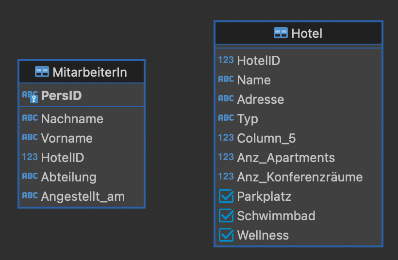

CREATE TABLE Ort ( 🏷
OrtID UUID NOT NULL,
Straße VARCHAR(255) NOT NULL,
Hausnummer VARCHAR(255) NOT NULL,
PLZ VARCHAR(255) NOT NULL,
Stadt VARCHAR(255) NOT NULL,
PRIMARY KEY (OrtID),
CHECK (regexp_matches(PLZ, '^[0-9]{5}$'))
);

CREATE TABLE ManagerIn ( 🏷
PersID VARCHAR(255) NOT NULL,
Letzte_Fortbildung DATE,
Nächste_Fortbildung DATE NOT NULL,
Bonus NUMERIC(8,2) NOT NULL,
PRIMARY KEY (PersID),
FOREIGN KEY (PersID) REFERENCES MitarbeiterIn(PersID),
CHECK (Letzte_Fortbildung < Nächste_Fortbildung)
);

INSERT INTO Ort VALUES 🏷
('E8253FFA-B761-42AB-BCC5-AA911FB11390', 'Albrechtstraße', '5', '10117', 'Berlin'),
('C622F45A-4AD4-40F7-9DAA-885E7A8A304C', 'Müllerstraße', '151a', '13353', 'Berlin'),
('1A676D60-96C9-4F0D-9E16-635A78F1D3E2', 'Bjoernsonstraße', '10', '10439', 'Berlin'),
('0D73C49F-6E23-49E8-B453-60E03C905A82', 'Willy-Brandt-Platz', '3', '81829', 'München'),
('3123600D-8CC5-4455-B010-32781CEBF7B9', 'Albrechtstraße', '13', '80636', 'München');

ALTER TABLE Hotel DROP COLUMN Adresse;
ALTER TABLE Hotel ADD COLUMN OrtID UUID;

UPDATE Hotel SET OrtID = 'E8253FFA-B761-42AB-BCC5-AA911FB11390' WHERE HotelID = 1001;
UPDATE Hotel SET OrtID = 'C622F45A-4AD4-40F7-9DAA-885E7A8A304C' WHERE HotelID = 1002;
UPDATE Hotel SET OrtID = 'C622F45A-4AD4-40F7-9DAA-885E7A8A304C' WHERE HotelID = 1003;
UPDATE Hotel SET OrtID = '1A676D60-96C9-4F0D-9E16-635A78F1D3E2' WHERE HotelID = 1004;
UPDATE Hotel SET OrtID = '0D73C49F-6E23-49E8-B453-60E03C905A82' WHERE HotelID = 1005;
UPDATE Hotel SET OrtID = '3123600D-8CC5-4455-B010-32781CEBF7B9' WHERE HotelID = 1006;

ALTER TABLE Hotel RENAME COLUMN Column_5 TO Anz_Zimmer;
ALTER TABLE MitarbeiterIn ADD COLUMN Gehalt UINTEGER;
ALTER TABLE MitarbeiterIn  ALTER COLUMN Angestellt_am SET DATA TYPE DATE USING CAST(STRPTIME(Angestellt_am, '%d-%m-%Y') AS DATE);
DELETE FROM MitarbeiterIn WHERE Vorname = 'Tedra' AND Nachname = 'Traice';

UPDATE MitarbeiterIn SET Gehalt = 2000 WHERE Abteilung = 'Sicherheit';
UPDATE MitarbeiterIn SET Gehalt = 2200 WHERE Abteilung = 'Reinigung';
UPDATE MitarbeiterIn SET Gehalt = 2600 WHERE Abteilung = 'Rezeption';
UPDATE MitarbeiterIn SET Gehalt = 3200 WHERE Abteilung = 'Management';

INSERT INTO ManagerIn VALUES('em300003', '2023-10-21', '2024-06-12', 936.50);
INSERT INTO ManagerIn VALUES('em300004', '2024-01-13', '2024-09-02', 0.0);
INSERT INTO ManagerIn VALUES('em300011', '2023-11-14', '2024-06-12', 1500.00);
INSERT INTO ManagerIn VALUES('em300013', '2024-01-13', '2024-09-02', 345.78);
INSERT INTO ManagerIn VALUES('em300016', '2023-11-14', '2024-07-27', 0.00);
INSERT INTO ManagerIn VALUES('em300021', '2024-01-13', '2024-07-27', 0.00);
