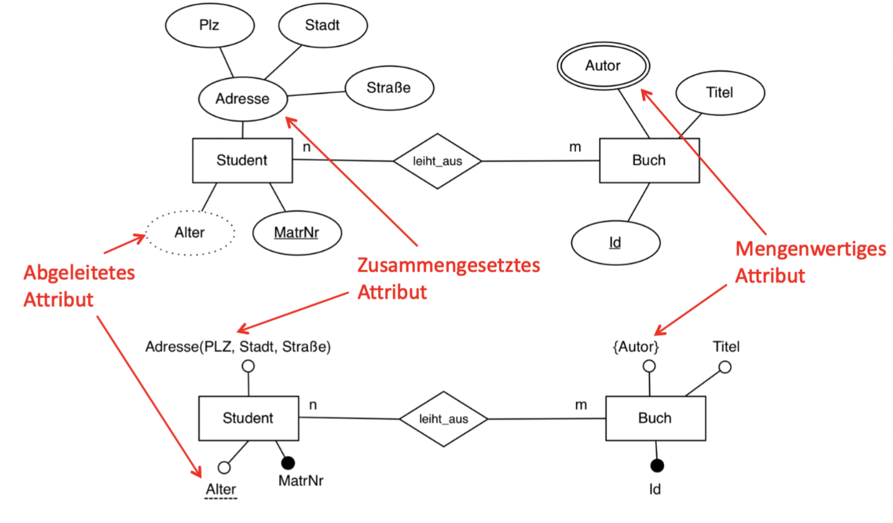

### **Eine Datenbank**

ist eine Sammlung von Daten ,die einen Ausschnitt der realen Welt beschreiben.

### **Datenbankmanagementsystem DBMS**

ist ein Softwaresystem,dem Benutzer das Erstellen und Pflege einer Datenbank ermöglicht.

Nach **Peter P. Chen** 1976, The entity-relationship model – towards a unified view of data.

### **Entity / Entität**

ein Ding / Objekt der realen oder der Vorstellungswelt, Nicht direkt darstellbar, sondern nur über Eigenschaften beobachtbar

### **Entity-Typ (entity set)**

eine Menge gleichartiger Objekte

### **Relationship**

beschreibt Beziehungen zwischen Entities, meist binär

### **Relationship-Typ**

eine Menge gleichartiger Beziehungen

### **Attribut**

repräsentiert eine Eigenschaft von Entities oder von Relationships

---

### **Optionales Attribut**

Attributwert nicht für jedes Entity vorhanden

### **Abgeleitetes Attribut**

Wert wird anhand einer Berechnungsvorschrift aus gespeicherten Attributen errechnet.

### **Mengenwertiges Attribut**

enthält Menge von Werten

### **Strukturiertes (zusammengesetztes) Attribut**

wird durch weitere Attribute beschrieben, Wert des strukturierten Attributs entspricht Verkettung der Unterattribute

---

### **Schlüssel**

ein oder mehrere Attribute, Werte identifizieren eindeutig ein Entity

### **Referentielle Integrität**

Existenz des referenzierten Entities

### **Domänen**

Einschränkung des Wertebereichs

### **Ein Schlüssel**

ist eine Menge von Attributen eines Entity-Typs, für die gilt, dass keine zwei Entities gleiche Werte in allen Schlüsselattributen haben. Einige Attributwerte können übereinstimmen. Oft nur ein Attribut

### **Für jeden Entity-Typ**

muss ein Schlüssel angegeben werden
