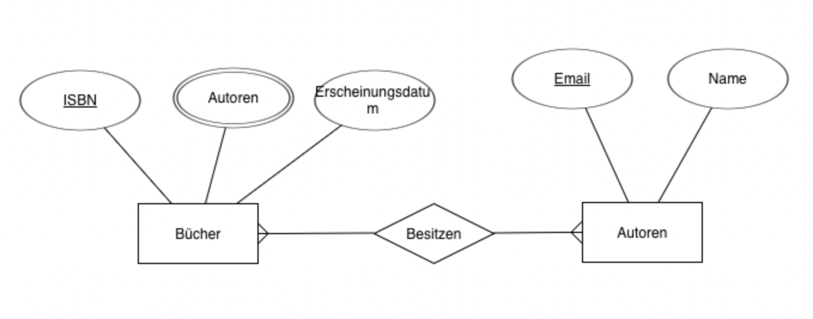
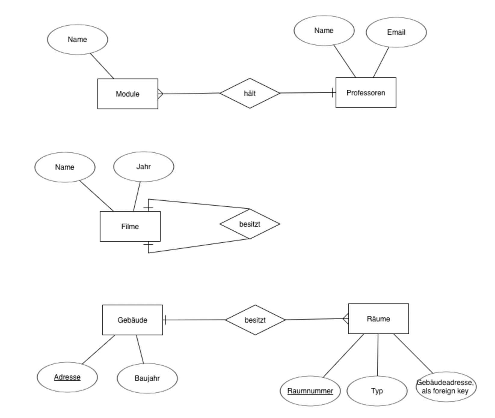
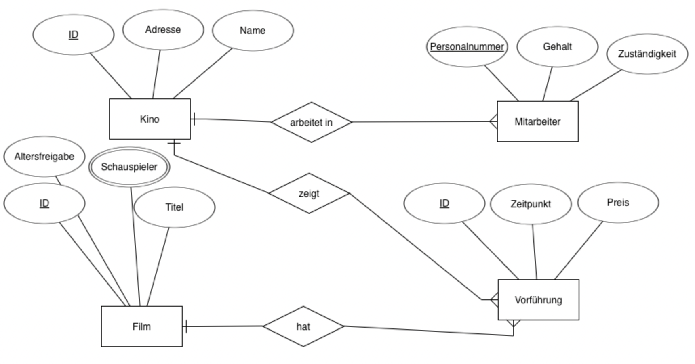

## Aufgabe 1

Die folgenden Teilaufgaben beziehen sich auf die folgende Aussage:

Ein Buch hat eine ISBN, ein Erscheinungsdatum und kann mehrere Autoren besitzen. Autoren haben eine E-Mail und einen Namen. Bücher haben zudem ein Alter, welches sich aus dem Erscheinungsdatum berechnen lässt.

#### Aufgabe 1.1

Modellieren Sie das in der Aussage dargestellte Sachverhältnis, zuerst ohne Nutzung von Relationship-Typen.

#### Aufgabe 1.2

Welches oder welche Attribute des in Aufgabe 1.1 erarbeiteten ER-Diagramms ist bzw. sind ein geeigneter Schlüssel und wieso?

#### Aufgabe 1.3

Modellieren Sie die Aussage aus Aufgabe 1.1 nun ohne Nutzung von komplexen Attributen und mit einem Relationship-Typ.

---

* **Buch**: Die ISBN ist ein geeigneter Schlüssel für die Entität "Buch", da jede ISBN einzigartig ist und jedes Buch eindeutig identifizieren kann.
* **Autor**: Die E-Mail-Adresse ist ein geeigneter Schlüssel für die Entität "Autor", da sie einzigartig für jeden Autor ist und somit zur eindeutigen Identifikation verwendet werden kann.

**Entitäten:**

* **Buch**
  * ISBN
  * Erscheinungsdatum
* **Autor**
  * E-Mail
  * Name

**Relationship:**

* **Besitzen**
  * Verbindet Bücher und Autoren.
  * Jedes Buch kann von mehreren Autoren geschrieben sein.
  * Jeder Autor kann mehrere Bücher schreiben.
  * Diese Beziehung ist eine M:N-Beziehung (viele-zu-viele).

---

## Aufgabe 2: ER-Modelle

Modellieren Sie die Aussagen der folgenden Teilaufgaben.

### Aufgabe 2.1

Ein Modul, welches einen Namen besitzt, kann von mehreren Professoren gehalten werden. Professoren haben einen Namen und eine E-Mail. Jedes Modul hat genau einen verantwortlichen Professor. Verschiedene Professoren können Module in unterschiedlichen Räumen halten.

### Aufgabe 2.3

Filme, welche einen Namen und ein Jahr haben, können einen Nachfolger und Vorgänger besitzen.

### Aufgabe 2.4

Gebäude, welche ein Baujahr und eine Adresse haben, besitzen Räume eines bestimmten Typs. Modellieren Sie dies sowohl ohne als auch mit schwachen Entity-Typen.

### Aufgabe 2.5

Firmen haben eine Adresse, eine Telefonnummer und produzieren Hüte, welche einen bestimmten Stil haben, mit verschiedenen Materialien. Eine Eigenschaft von Materialien ist deren Farbe. Modelliere dies sowohl anhand von ternären Beziehungen als auch schwachen Entitäten.

---

**Aufgabe 2.4**

Zur Modellierung des gegebenen Szenarios, in dem Gebäude mit Baujahr und Adresse existieren und verschiedene Räume eines bestimmten Typs beinhalten, werde ich zwei Entwürfe anbieten: einen ohne schwache Entitätstypen und einen mit schwachen Entitätstypen.

### Modellierung ohne schwache Entity-Typen

**Entitäten und Attribute:**

* **Gebäude**
  * Adresse (Primärschlüssel, da sie eindeutig ist)
  * Baujahr
* **Raum**
  * Raumnummer (Identifikation innerhalb eines Gebäudes)
  * Typ (z. B. Büro, Klassenzimmer, Labor)
  * Gebäudeadresse (Fremdschlüssel, der auf die Adresse des Gebäudes verweist)

**Beziehung:**

* **Beinhaltet**
  * Eine 1:N-Beziehung zwischen Gebäude und Raum: Ein Gebäude kann mehrere Räume enthalten, aber jeder Raum gehört zu genau einem Gebäude.

---

## Aufgabe 4: Kino

Die Chefin der Kinokette CineKinoSpielhaus möchte gerne zur Effizienzsteigerung ihr Kino-Business digital abbilden. Sie hat dafür Statements von verschiedenen Personen eingeholt und einen Gebäudeplan als grundlegende Ressourcen bereitgestellt und beauftragt nun Sie, ein entsprechendes vollständiges ER-Modell zu erstellen. So wie im echten Leben auch sind nicht alle Sachverhalte bis ins feinste Detail beschrieben. Ergänzen Sie ggf. fehlende Eigenschaften wie Totalitäten und Kardinalitäten durch schlüssiges Denken und notieren Sie sich Ihre Herangehensweise und Grundannahmen.

